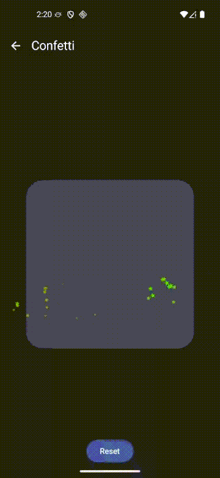
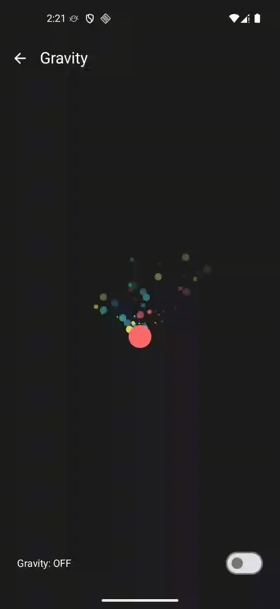
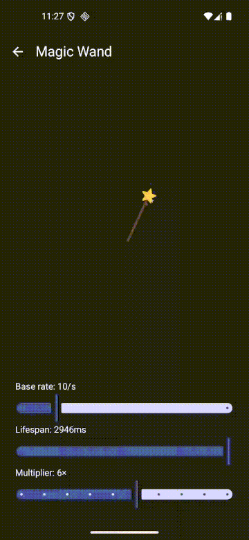

# ParticleEmitter

A Jetpack Compose particle effects library for Android. Create beautiful, physics-based particle animations with two rendering approaches optimized for different use cases.

## Features

- **Two rendering engines:**
  - `ParticlesEmitter` — Compose layout-based, supports custom `@Composable` particles (text, images, shapes)
  - `CanvasParticleEmitter` — Canvas-based, high-performance rendering for 100+ particles
- **Physics simulation** — Directional gravity, force, angle, rotation, horizontal displacement
- **Configurable gravity** — Control gravity strength and direction to create falling confetti, rain, rising bubbles, wind effects, and more
- **Flexible particle shapes** — Circles, images with tinting, custom paths
- **Edge behavior** — Particles can bounce, stick, or wrap at screen boundaries
- **Configurable easing** — Per-particle easing curves for scale and alpha
- **Blend modes** — Additive, screen, and other blend effects for glowing particles
- **Multi-emitter orchestration** — Sequential or overlapping emitters with `MultiEmitter`
- **Emitter source shapes** — Point, oval, rectangle, vertical/horizontal lines

## Performance

See [PERFORMANCE.md](PERFORMANCE.md) for measured particle-count budgets per target frame rate (30 / 60 / 120 FPS), benchmark methodology, and sizing guidance for `CanvasParticleEmitter` on real hardware.

## Installation

Add the dependency to your module's `build.gradle`:

```groovy
dependencies {
    implementation "io.github.piotrprus:particle-emitter:1.0.4"
}
```

or with Kotlin DSL:

```kotlin
dependencies {
    implementation("io.github.piotrprus:particle-emitter:1.0.4")
}
```

Make sure you have `mavenCentral()` in your project's repositories:

```groovy
repositories {
    mavenCentral()
}
```

## Modules

| Module | Description |
|--------|-------------|
| `particle-emitter` | Core library — emitters, particle models, configs, rendering |
| `sample` | Demo app showcasing different particle effects |

## Usage

### Canvas Emitter (recommended for performance)

```kotlin
CanvasParticleEmitter(
    modifier = Modifier.fillMaxSize(),
    config = CanvasEmitterConfig(
        particlePerSecond = 50,
        emitterCenter = DpOffset(200.dp, 400.dp),
        startRegionShape = CanvasEmitterConfig.Shape.POINT,
        startRegionSize = DpSize(0.dp, 0.dp),
        particleShapes = listOf(ParticleShape.Circle),
        lifespanRange = 800..1200,
        fadeOutTime = 600..1000,
        scaleTime = 800..1200,
        colors = listOf(Color.Cyan, Color.Magenta, Color.Yellow),
        particleSizes = listOf(DpSize(8.dp, 8.dp), DpSize(12.dp, 12.dp)),
        spread = IntRange(-90, 90),
        blendMode = BlendMode.Screen,
        initialForce = IntRange(50, 150),
    )
)
```

### Compose Emitter (for custom particle content)

```kotlin
ParticlesEmitter(
    config = EmitterConfig(
        particlesCount = 30,
        emitDurationMillis = 1000L,
        particleLifespanMillis = 2000L,
        initialForce = 80,
        gravityStrength = 1f,
        gravityAngle = 0, // 0 = down
        spread = IntRange(-45, 45),
    ) {
        // Any @Composable content as a particle
        Text("✨", fontSize = 20.sp)
    }
)
```

### Multi Emitter (sequential bursts)

```kotlin
MultiEmitter(
    modifier = Modifier.fillMaxSize(),
    emitterCount = 5,
    emitterDelay = 200L,
    emitterConfig = EmitterConfig(
        particlesCount = 20,
        particleLifespanMillis = 1500L,
    ) {
        Box(
            modifier = Modifier
                .size(8.dp)
                .background(Color.White, CircleShape)
        )
    }
)
```

## Gravity

Both emitters support configurable directional gravity via two parameters:

| Parameter | Type | Default | Description |
|-----------|------|---------|-------------|
| `gravityStrength` | `Float` | `0f` (Canvas) / `1f` (Compose) | Force magnitude in Dp/s². `0` = no gravity. |
| `gravityAngle` | `Int` | `0` | Direction in degrees. `0` = down, `180` = up, `-90` = right, `90` = left. |

### Examples

```kotlin
// Falling confetti — gravity pulls particles downward
CanvasEmitterConfig(
    gravityStrength = 120f,
    gravityAngle = 0,       // down
    spread = IntRange(-45, 45),
    initialForce = IntRange(80, 160),
    // ...
)

// Rising bubbles — gravity pulls particles upward
CanvasEmitterConfig(
    gravityStrength = 50f,
    gravityAngle = 180,     // up
    // ...
)

// Wind effect — gravity pushes particles to the right
CanvasEmitterConfig(
    gravityStrength = 80f,
    gravityAngle = -90,     // right
    // ...
)
```

### How it works

The `CanvasParticleEmitter` uses physics-based motion: each particle has an initial velocity (from `initialForce` and `spread` angle) and is continuously accelerated by the gravity vector. This produces natural parabolic arcs — particles launched upward will curve back down, particles with sideways gravity will drift horizontally.

The `ParticlesEmitter` applies the same directional gravity to its kinematic equations, allowing custom composable particles to follow realistic trajectories.

## Edge Behavior

The `CanvasParticleEmitter` supports configurable edge behavior — controlling what happens when particles reach the composable boundary.

| Behavior | Description |
|----------|-------------|
| `EdgeBehavior.None` | Particles pass through edges freely (default) |
| `EdgeBehavior.Bounce(damping)` | Particles reflect off edges. `damping` controls velocity retained per bounce (0–1, default `0.7`) |
| `EdgeBehavior.Stick` | Particles stop at the edge and remain there for the rest of their lifespan |
| `EdgeBehavior.Wrap` | Particles exiting one edge reappear on the opposite side |

```kotlin
// Bouncing particles with 70% energy retention
CanvasEmitterConfig(
    edgeBehavior = EdgeBehavior.Bounce(damping = 0.7f),
    // ...
)

// Particles stick to edges
CanvasEmitterConfig(
    edgeBehavior = EdgeBehavior.Stick,
    // ...
)

// Particles wrap around
CanvasEmitterConfig(
    edgeBehavior = EdgeBehavior.Wrap,
    // ...
)
```

Edge collision accounts for particle size — the visual edge of the particle touches the boundary, not the center.

## Hide In Start Region

With a ring-shaped emitter (`Shape.OVAL`) and a 360° spread, roughly half the particles travel *through* the interior of the ring, cluttering the center. Set `hideInStartRegion = true` to skip drawing any particle whose current position is inside the start region — particles that leave the region become visible again on the far side.

| Parameter | Type | Default | Description |
|-----------|------|---------|-------------|
| `hideInStartRegion` | `Boolean` | `false` | When `true`, particles currently inside the `startRegionShape` + `startRegionSize` bounds are not drawn. Applies to `OVAL` and `RECT` regions. `POINT`, `H_LINE`, and `V_LINE` have no interior and the flag is a no-op. |

```kotlin
// Ring emitter that keeps its interior clean
CanvasEmitterConfig(
    startRegionShape = CanvasEmitterConfig.Shape.OVAL,
    startRegionSize = DpSize(180.dp, 180.dp),
    spread = IntRange(0, 360),
    hideInStartRegion = true,
    // ...
)
```

Particles still exist and move through the region (physics is untouched); they're just invisible while their position falls inside.

## Particle Shapes

```kotlin
// Circle
ParticleShape.Circle

// Image with tinting
ParticleShape.Image(ImageBitmap.imageResource(R.drawable.star))

// Custom path
ParticleShape.PathShape(myCustomPath)

// Text (emoji or regular text) — requires a TextMeasurer
ParticleShape.Text(
    text = "🎉",
    textStyle = TextStyle(fontSize = 20.sp),
    textMeasurer = rememberTextMeasurer(),
)
```

## Sample App

The sample app includes interactive demos:

| Canvas Emitter | Confetti | Glow Particles |
|:-:|:-:|:-:|
|  |  |  |
| Star particles with birth rate slider | Multi-emitter confetti with emoji and glowing stars | Glowing particles with blur and color animations |

| Gravity | Gravity Point | Sticky Edges |
|:-:|:-:|:-:|
|  |  |  |
| Canvas particles with gravity on/off toggle | Draggable gravity attractor with force slider | Particles bounce, stick, or wrap at edges |

| Magic Wand | Emoji Rain |
|:-:|:-:|
|  |  |
| Drag a wand to leave a sparkling trail of stars | Fullscreen emoji particles using the Text shape |

## Building

```bash
# Build library
./gradlew :particle-emitter:assembleRelease

# Run sample app
./gradlew :sample:installDebug
```

## License

Apache License 2.0
